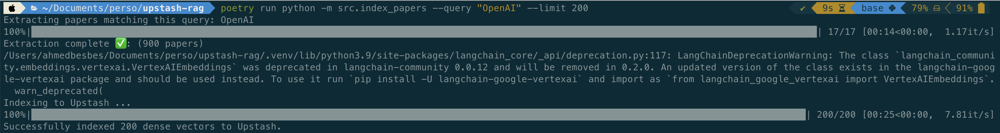
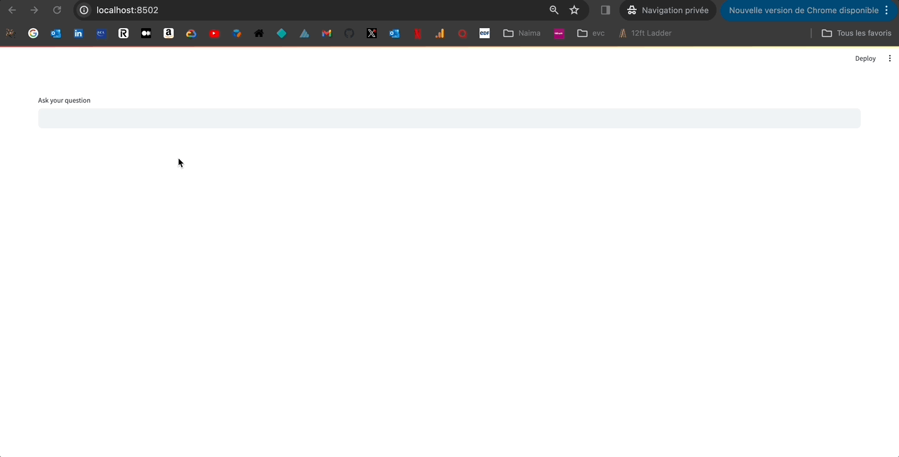

The repo contains the code for building a RAG-based assistant to chat with Papers With Code.


### 1.  Indexing

To index data into the vector DB, you first need to create an index on Upstash and fill in the credentials in the `.env` file:

```
UPSTASH_URL=...
UPSTASH_TOKEN=...
```

Then you have to srun this command:

```bash
poetry run python -m src.index_papers --query "OpenAI" --limit 200
```

Here's the result of indexing 200 chunks matching the "OpenAI" query.




### 2. Run the Streamlit application to interact with the RAG

To interactively play with the RAG and check the source documents, you can start a small Streamlit app with this command:

```bash
poetry run python -m streamlit run  src/app.py --theme.primaryColor "#135aaf"
```




### More details

Check Medium post.