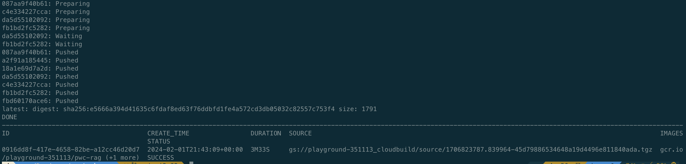
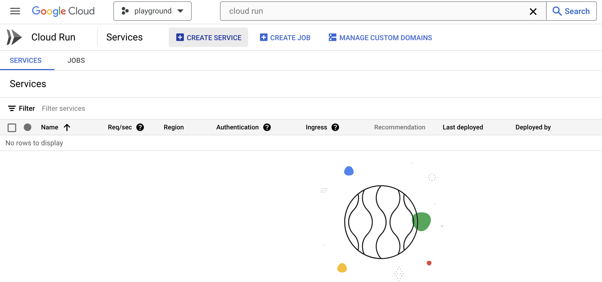
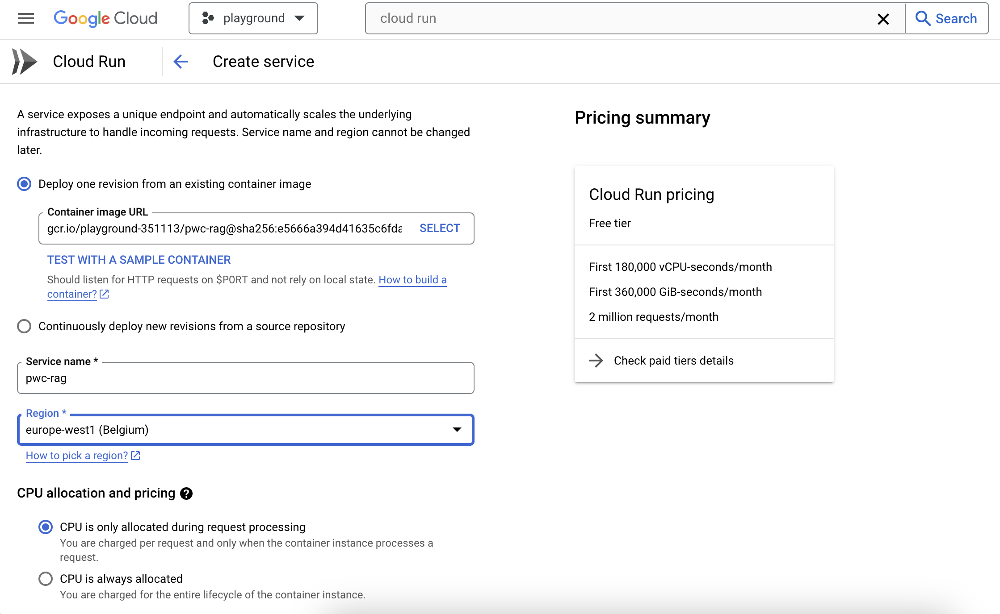
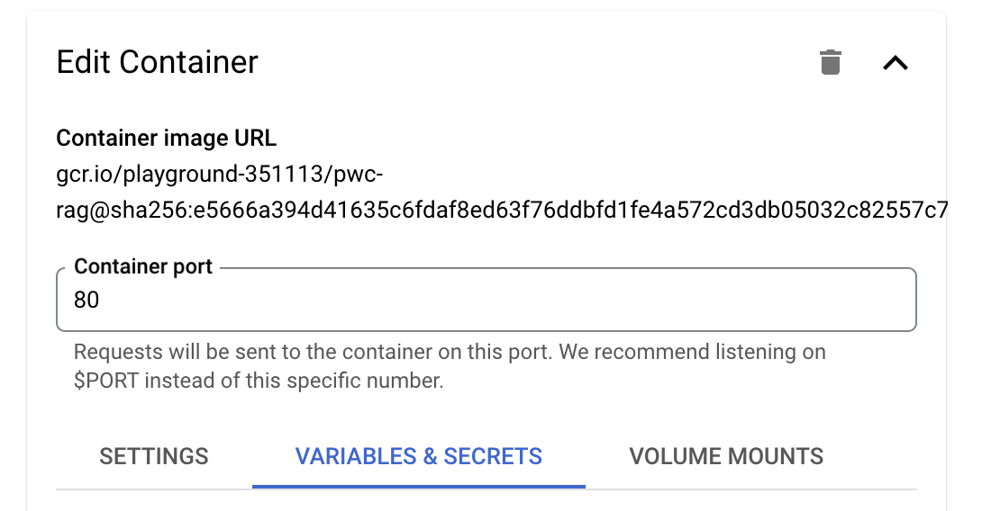
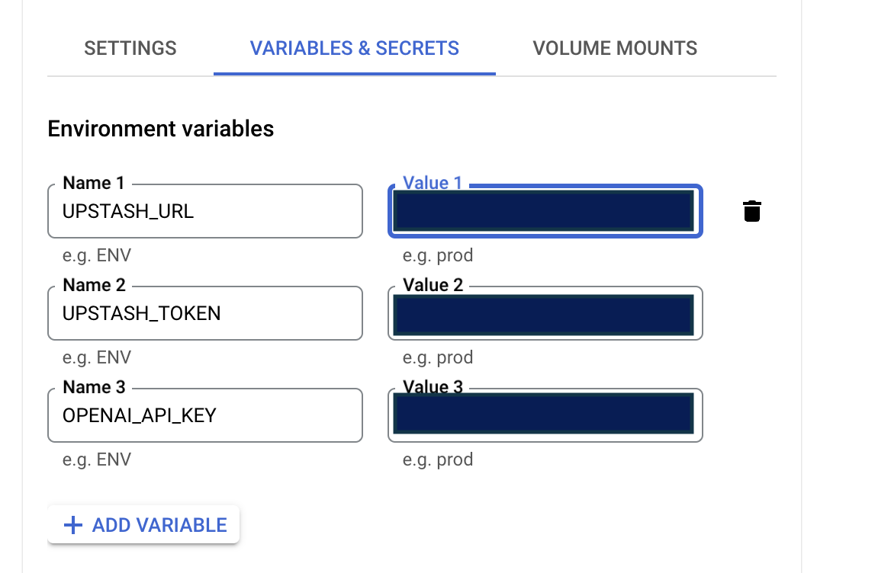
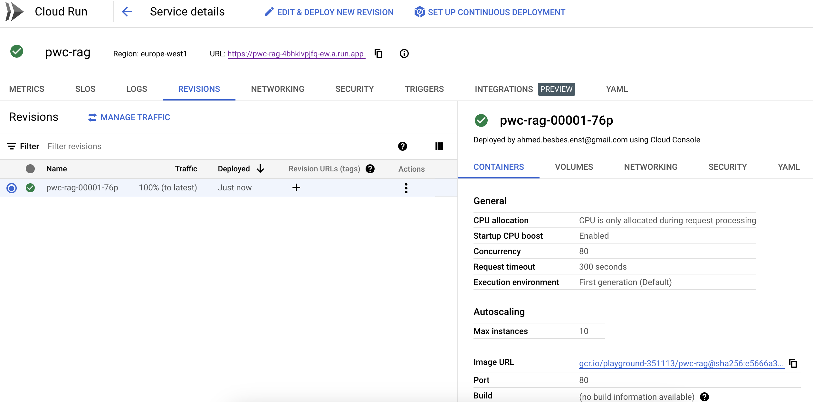
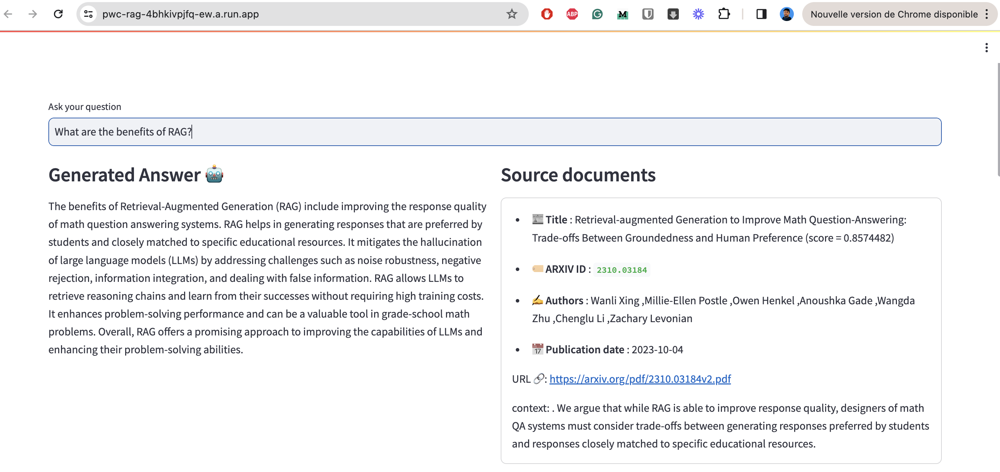

This repo contains the code for building a RAG-based assistant to chat with Papers With Code.

### 0. Some requirements

- A GCP account with VertexAI and Cloud Run services activated
- An OpenAI key
- A free account on [Upstash](https://upstash.com/) (serverless database)


### 1.  Indexing

To index data into the vector DB, you first need to create an index on Upstash and fill in the credentials in the `.env` file:

```
UPSTASH_URL=...
UPSTASH_TOKEN=...
```

Then you have to run this command:

```bash
poetry run python -m src.index_papers --query "OpenAI" --limit 200
```

Here's the result of indexing 200 chunks matching the "OpenAI" query.


### 2. Run the Streamlit application locally to interact with the RAG


```bash
poetry run python -m streamlit run  src/app.py --theme.primaryColor "#135aaf"
```


### 3. Deploy the application to Cloud Run

Follow these steps:

Build the Docker image locally:

```bash
docker build -t chat-pwc .
```

Push the image to container registry:

```bash
gcloud builds submit --tag gcr.io/<PROJECT_ID>/pwc-rag --timeout=2h
```


Connect to GCP console, go to Cloud Run service and hit the button "Create service":



Fill in these parameters:

- The container image URL and the region



- The container port (To match the value mentioned in the Dockerfile=80)



- The secrets that will be injected as environment variables



- Activate unathenticated invocations


Then hit the create button:

- Once the service created, you'll see the corresponding URL



Now you can visit the app:




### More details

Check Medium [post](https://towardsdatascience.com/how-to-build-an-llm-powered-app-to-chat-with-paperswithcode-09ddd9ee753a).